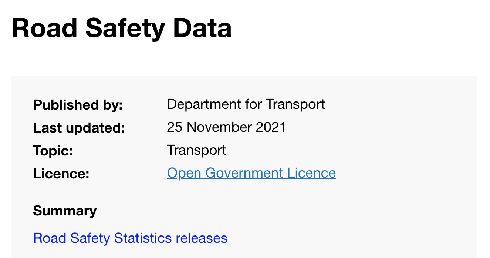
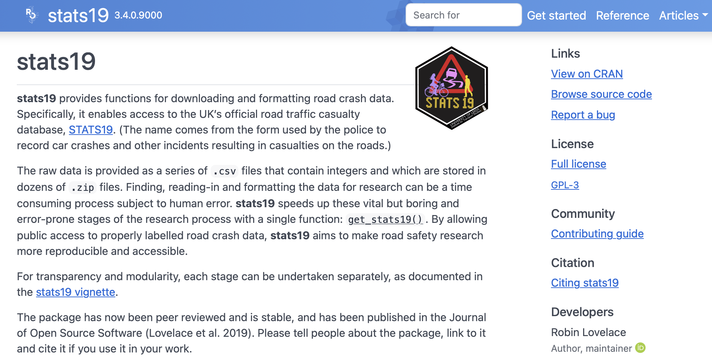
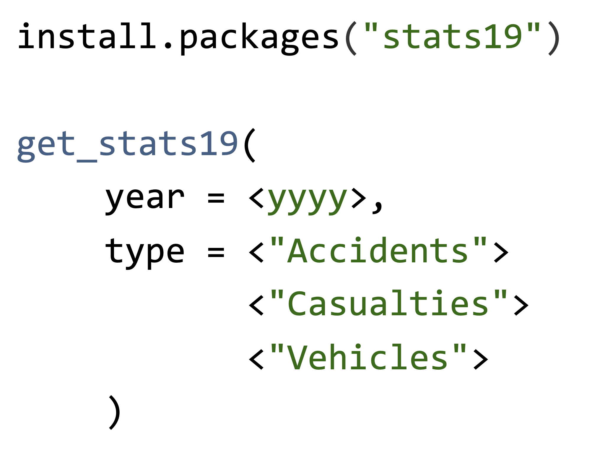
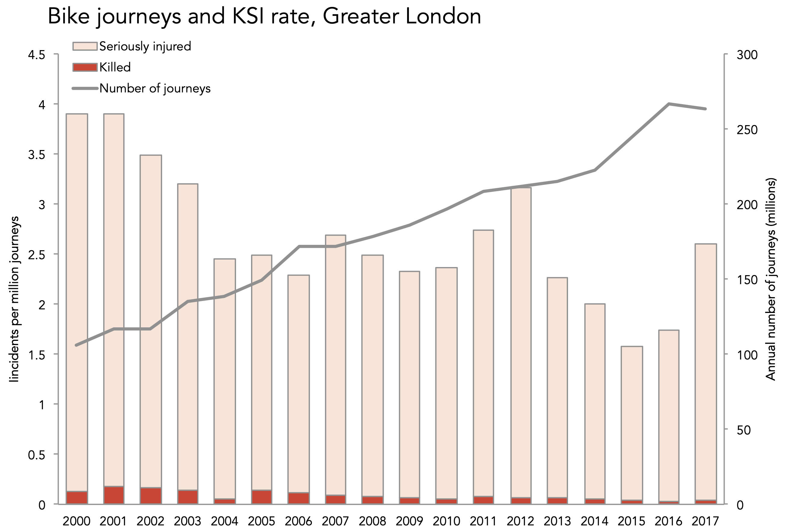
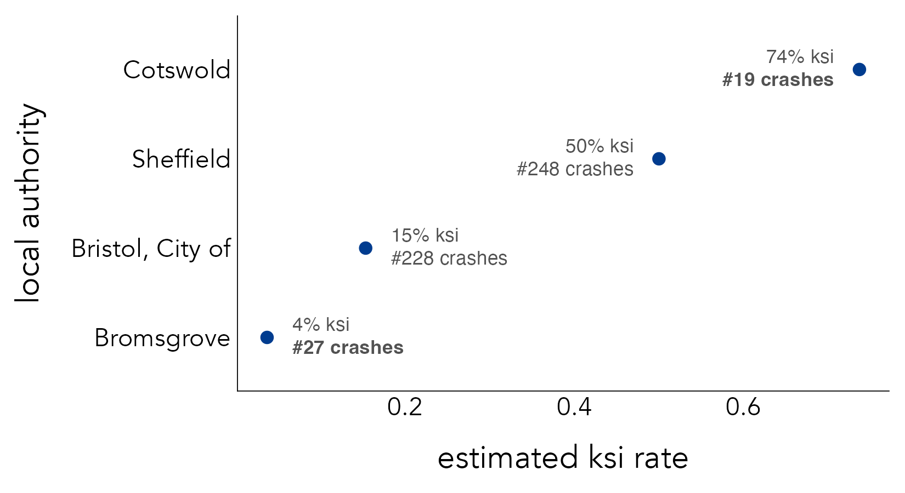
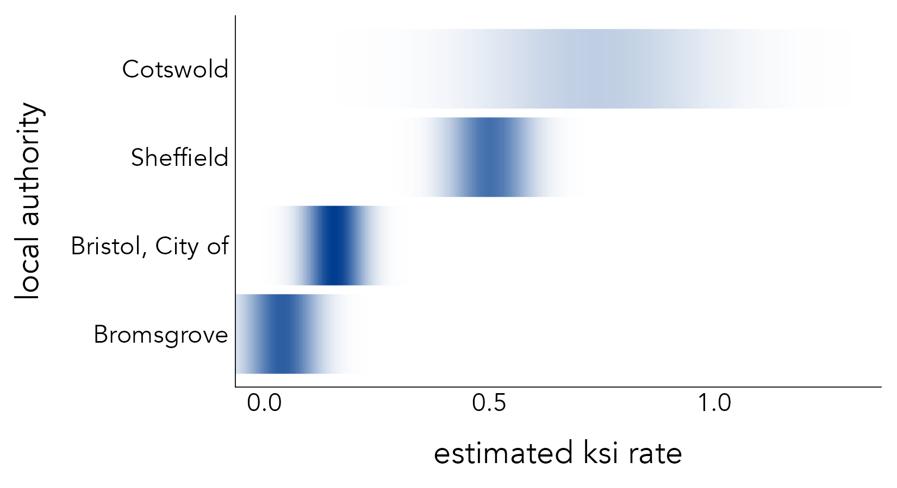
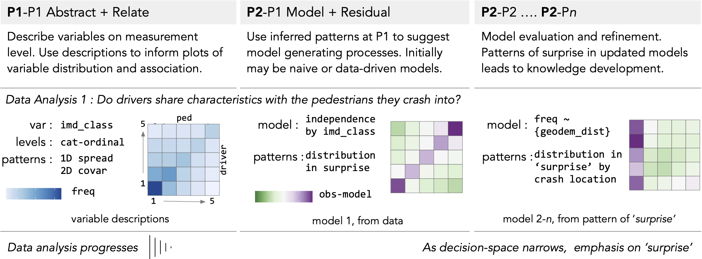
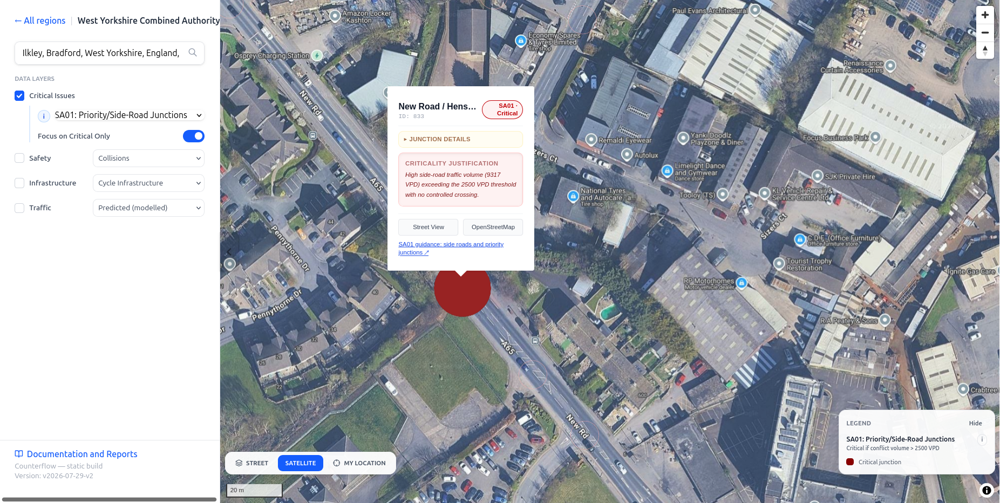

## Workshop Overview & Agenda {background-color="#f8f9fa"}

**Session Duration:** 60 Minutes

- **00:00 – 00:15** | **Introduction to STATS19 & `{stats19}`**
  - Canonical UK road crash dataset architecture (3 tables).
  - Package overview & rapid data download tour.
- **00:15 – 00:30** | **Research & Methodological Challenges**
  - Denominator neglect, aggregation scale, and inference pitfalls.
- **00:30 – 01:00** | **Interactive Breakout Groups**
  - **Group 1 (Robin)**: Hands-on code & vignette walkthrough (Laptops out!).
  - **Group 2 (Roger)**: Research design & analysis ideas discussion.
  - **Group 3**: Informal break / walk & networking.

---

# Part 1: The STATS19 Dataset & Package {background-color="#003366"}

---

## What is STATS19 Data?

{.absolute top=50 left=20 width="42%"} 
{.absolute top=80 left=600 width="35%"} 

---

## Relational Data Architecture

{.absolute top=100 left=30 width="75%"}

::: {.notes}
Three linked tables: Accidents/Collisions, Casualties, and Vehicles. Provides a wide set of possibilities for spatial and transport safety analysis.
:::

---

## The `{stats19}` R Package

{.absolute top=100 left=30 width="70%"}

::: {.notes}
Historically: messy annual zip files with changing column names and codings.
`{stats19}` solution: one-line functions to download, clean, and format data.
:::

---

## Rapid Data Retrieval

{.absolute top=70 left=30 width="50%"}

```r
library(stats19)
library(sf)
library(dplyr)

# Download crash data for a specific year
crashes_2022 <- get_stats19(year = 2022, type = "crash")

# Format into spatial sf object
crashes_sf <- format_sf(crashes_2022)

# Download casualties and vehicles linked to crashes
casualty_2022 <- get_stats19(year = 2022, type = "casualty")
vehicle_2022  <- get_stats19(year = 2022, type = "vehicle")
```

---

# Part 2: Research & Methodological Challenges {background-color="#003366"}

---

[**1. Denominators & Exposure**]{.absolute top=280 left=100 style="font-size: 2.5em; color: #003366;"}

---

{.absolute top=50 left=30 width="60%"}

::: {.notes}
Denominator neglect: counting crashes without accounting for exposure traffic volume or pedestrian flow.
:::

---

{.absolute top=50 left=30 width="60%"} 
{.absolute top=20 left=500 width="40%" style="transform: rotate(15deg);"}

---

{.absolute top=30 left=30 width="75%"}

[**Denominator Neglect!**]{.absolute top=20 left=620 style="transform: rotate(15deg); font-size: 1.5em; color: #D95F02; font-weight: bold;"}

---

[**2. Low Frequency Events & Aggregation**]{.absolute top=250 left=100 style="font-size: 2em; color: #003366;"}

::: {.notes}
Low-frequency events: what is an appropriate scale of analysis or spatial aggregation?
:::

---

{.absolute top=70 left=30 width="75%"} 

---

{.absolute top=70 left=30 width="75%"} 

---

{.absolute top=70 left=30 width="75%"} 

---

{.absolute top=70 left=30 width="75%"} 

---

[**3. Risk of 'Wonky' Inferences**]{.absolute top=250 left=100 style="font-size: 2em; color: #003366;"}

::: {.notes}
Crashes occur as a result of interacting conditioning context. Once you start decomposing statistical summaries, separating relative effects is challenging.
:::

---

{.absolute top=80 left=450 width="48%"}
{.absolute top=350 left=450 width="44%"}
{.absolute top=10 left=10 width="30%"}

---

## Tools in Action: `criticalissues`

A complementary tool for exploring road safety data at high spatial resolution:



- **Critical Issues** ([criticalissues.netlify.app](https://criticalissues.netlify.app)) combines STATS19 crash data with network infrastructure.
- Explore how spatial layers (signals, crossings, widths) relate to casualty clusters.

---

# Part 3: Breakout Workshop Groups {background-color="#003366"}

---

## Breakout Group 1: Technical & Hands-On Code

**Led by:** Robin (w/ Reka, Sam Langton)

- **Laptops Open!**
- Walkthrough of core `{stats19}` vignettes and spatial analysis workflows.
- Custom dataset filtering, joining `crashes` + `casualties` + `vehicles`.
- Troubleshooting technical questions or custom research pipelines.

---

## Breakout Group 2: Research Ideas & Study Design

**Led by:** Roger

- **Conceptual & Strategic Discussion**
- Brainstorming candidate research questions connecting road safety, crime, and transport planning.
- Discussion on data requirements, external denominators, and study design.
- Exploring potential collaboration and grant/paper proposals.

---

## Breakout Group 3: Walk & Informal Networking

- **Refresh & Recharge**
- Take an early lunch / outdoor walk.
- Informal discussions with colleagues.

---

## Resources & Links

- **Cars and Crime Workshop Site:** [robinlovelace.github.io/carscrime](https://robinlovelace.github.io/carscrime)
- **Source Code Repository:** [github.com/Robinlovelace/carscrime](https://github.com/Robinlovelace/carscrime)
- **Documentation & Package Website:** [docs.ropensci.org/stats19/](https://docs.ropensci.org/stats19/)
- **GitHub Repository:** [github.com/ropensci/stats19](https://github.com/ropensci/stats19)

Thank you for participating!